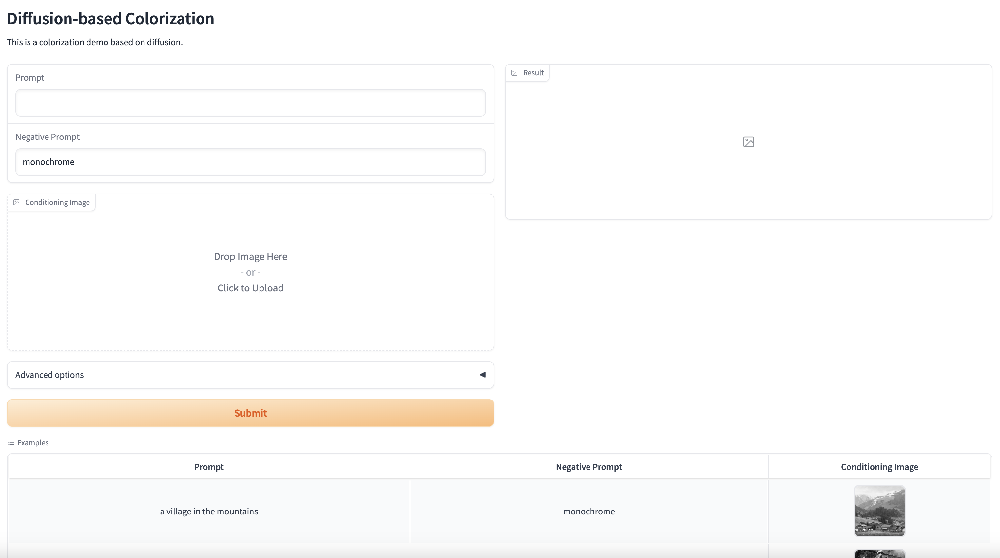

# Diffusion Model and ControlNet Based Image
## Install
```bash
git clone git@github.com:jingzhang00/colorization.git
pip install -r requirements.txt
```

## How to use
```bash
python main.py
```
Then you will get two URLs, one for local and one for the public, open it in the browser then the webpage should look like the following:


